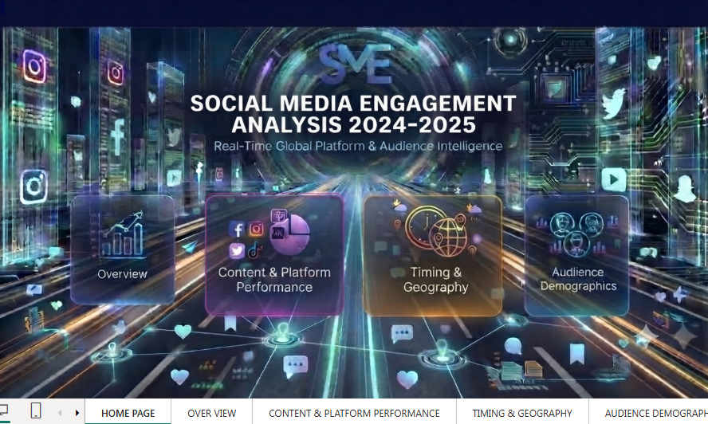
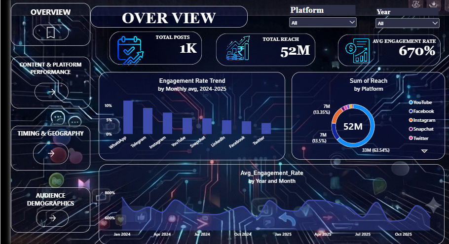
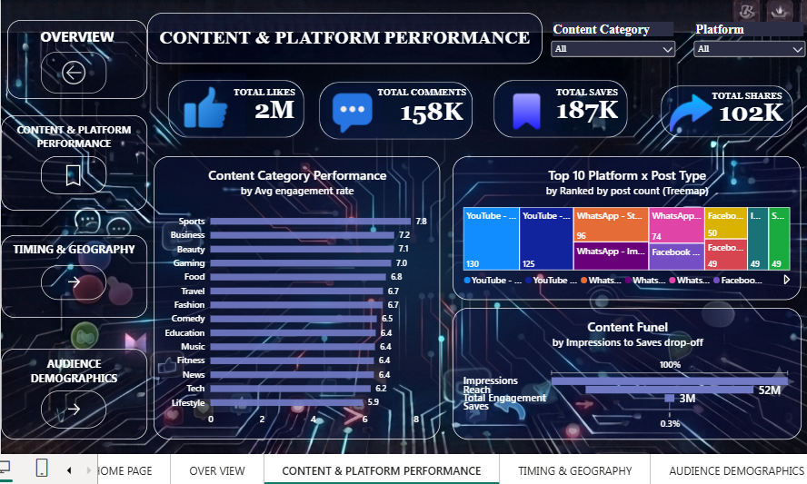
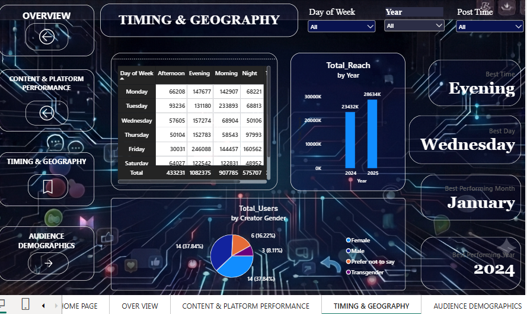
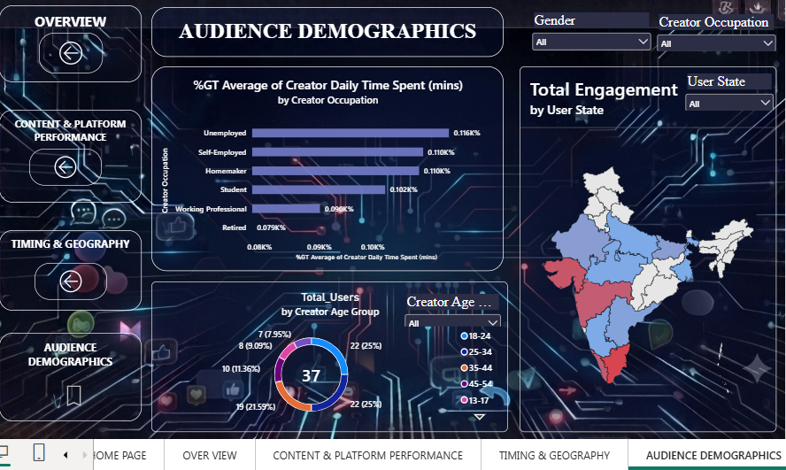

<div align="center">
*# 📊 Social Media Engagement Analysis 2024–2025*

An interactive Power BI dashboard for analyzing reach, engagement trends, content performance, posting-time patterns, geography, and audience demographics across 8 social media platforms.


---
</div>
## 🖼️ Dashboard Preview

### Home


### Overview


### Content & Platform Performance


### Timing & Geography


### Audience Demographics


---

## 📌 Project Overview

**Social Media Engagement Analysis 2024–2025** is an end-to-end Power BI analytics project that turns raw social media post data into an interactive business intelligence dashboard.

The dashboard is designed from the perspective of a creator, marketer, or social media manager who wants to understand:

- How much reach and engagement the content is generating
- Which platforms deliver the most reach and the highest engagement rate
- Which content categories and post types perform best
- When to post for the best results (time of day, day of week, month)
- How reach has changed from 2024 to 2025
- Who the creators and audience are (gender, age group, occupation, location)
- Which Indian states generate the most engagement

The final dashboard contains a **Home page + 4 analytical pages**, connected through interactive navigation.

---

## 🎯 Project Objectives

1. Monitor overall reach, engagement, and engagement-rate performance.
2. Compare platforms using reach, post volume, and average engagement rate.
3. Identify the content categories and post types that perform best.
4. Discover the best times and days to publish content.
5. Understand creator and audience demographics.
6. Identify high-engagement states across India.
7. Present insights through a clean, modern, interactive Power BI interface.

---

## 🧰 Tools & Technologies

| Tool / Technology | Purpose |
|---|---|
| **Microsoft Power BI** | Dashboard development and interactive reporting |
| **Power Query** | Data cleaning and transformation |
| **DAX** | Measures, KPIs, and analytical calculations |
| **Excel** | Source dataset |
| **Power BI Visuals** | Charts, cards, tables, treemap, maps, slicers, navigation |
| **GitHub** | Project documentation and version control |

---

## 🖥️ Dashboard Structure

The dashboard is organized into five pages:

| # | Page | Purpose |
|---|------|---------|
| 1 | 🏠 **Home** | Branded landing page with navigation to all sections |
| 2 | 📊 **Overview** | High-level view of posts, reach, and engagement-rate trends |
| 3 | 🎯 **Content & Platform Performance** | Likes, comments, saves, shares, category and post-type performance |
| 4 | ⏰ **Timing & Geography** | Best time, day, and month to post; reach by year; gender split |
| 5 | 👥 **Audience Demographics** | Time spent by occupation, age groups, and engagement by state |

---

## 🏠 1. Home Page

The Home page is the navigation hub of the dashboard.

**Features**
- Project title and subtitle: *Real-Time Global Platform & Audience Intelligence*
- Navigation cards for Overview, Content & Platform Performance, Timing & Geography, and Audience Demographics
- Interactive page navigation
- Consistent dark, futuristic analytics theme

---

## 📊 2. Overview

A quick summary of the overall social media performance.

### KPI Cards
| KPI | Description |
|---|---|
| **Total Posts** | Number of posts analyzed (1,200) |
| **Total Reach** | Total unique audience reached (~52M) |
| **Avg Engagement Rate** | Average engagement rate across posts (~6.70%) |

### Visuals
- **Engagement Rate Trend by Platform:** compares average engagement rate across platforms.
- **Sum of Reach by Platform:** donut chart showing each platform's share of total reach.
- **Avg Engagement Rate by Year and Month:** area chart showing how engagement moves over 2024–2025.
- **Slicers:** filter the page by Platform and Year.

### Business Questions Answered
- How many posts and how much reach does the account generate?
- What is the average engagement rate?
- Which platform drives the most reach?
- Which platform has the highest engagement rate?
- How does engagement change month to month?

---

## 🎯 3. Content & Platform Performance

Focuses on how content performs across platforms, categories, and post types.

### KPI Cards
| KPI | Description |
|---|---|
| **Total Likes** | Sum of all likes |
| **Total Comments** | Sum of all comments |
| **Total Saves** | Sum of all saves |
| **Total Shares** | Sum of all shares |

### Visuals
- **Content Category Performance:** bar chart of average engagement rate for 14 categories (Sports, Business, Beauty, Gaming, Food, Travel, and more).
- **Top 10 Platform × Post Type:** treemap ranking platform and post-type combinations by post count.
- **Content Funnel:** drop-off from Impressions → Reach → Total Engagement → Saves.
- **Slicers:** filter by Content Category and Platform.

### Business Questions Answered
- Which content categories earn the highest engagement rate?
- Which platform and post-type combinations are used most?
- How much of the audience reached actually engages?
- How do likes, comments, saves, and shares compare?

---

## ⏰ 4. Timing & Geography

Helps decide **when** to post and shows how reach has grown.

### Highlight Cards
Dynamic cards showing the best time, best day, best-performing month, and best-performing year.

### Visuals
- **Day of Week × Post Time matrix:** reach for Morning, Afternoon, Evening, and Night on each weekday.
- **Total Reach by Year:** compares 2024 and 2025.
- **Total Users by Creator Gender:** donut chart of the gender split.
- **Slicers:** filter by Day of Week, Year, and Post Time.

### Business Questions Answered
- Which time of day generates the most reach?
- Which days and months perform best?
- How did total reach change from 2024 to 2025?
- What is the gender distribution of creators?

---

## 👥 5. Audience Demographics

Explains who the creators and audience are, and where engagement comes from.

### Visuals
- **Average Daily Time Spent by Creator Occupation:** compares Unemployed, Self-Employed, Homemaker, Student, Working Professional, and Retired.
- **Total Users by Creator Age Group:** donut chart across 13–17, 18–24, 25–34, 35–44, 45–54, and 55+.
- **Total Engagement by User State:** filled map of India highlighting high- and low-engagement states.
- **Slicers:** filter by Gender, Creator Occupation, Creator Age Group, and User State.

### Business Questions Answered
- Which occupations spend the most time on social media?
- Which age groups are the most active?
- Which states generate the most engagement?

---

## 📁 Dataset

The analysis uses a dataset of **1,200 social media posts** with **36 attributes**, covering **January 2024 to December 2025**. The data spans **8 platforms** (Instagram, Facebook, YouTube, WhatsApp, Telegram, Snapchat, LinkedIn, Twitter), **11 post types**, and **14 content categories**, with creators and users across **14 Indian states**.

**Data fields include:**

| Group | Fields |
|---|---|
| **Post details** | Post ID, date, year, month, day of week, post time, platform, account name, post type, content category, caption length, hashtag count |
| **Engagement metrics** | Likes, comments, shares, saves, total engagement, reach, impressions, engagement rate (%), followers at post time |
| **Creator profile** | Gender, age group, occupation, device type, city, state, country, daily time spent, time-spent tier, sessions per day, usage purpose, posts per week, account join year |
| **User location** | User city, user state |

The dataset is complete, with **no missing values and no duplicate Post IDs**, so it was ready for modeling in Power BI.

**Source:** * Kaggle and synthetic data 

---

## 🧹 Data Preparation

Data preparation activities included:

- Reviewing the source schema and column data types
- Checking for missing values and duplicate records
- Standardizing fields used for analysis (dates, categories, time buckets)
- Preparing categorical and numerical columns for Power BI
- Creating analytical measures in DAX
- Validating calculated KPIs against the source data
- Formatting numeric values for dashboard readability

---

## 🧮 DAX & Analytical Calculations

The dashboard uses DAX measures for reusable calculations such as:

- Total Posts
- Total Reach
- Total Impressions
- Average Engagement Rate
- Total Likes, Comments, Saves, and Shares
- Best Time, Best Day, Best Month, and Best Year (dynamic cards)

**Example: Total Reach**
```DAX
Total Reach =
SUM ( 'Engagement Data'[Reach] )
```

**Example: Average Engagement Rate**
```DAX
Avg Engagement Rate =
AVERAGE ( 'Engagement Data'[Engagement Rate (%)] )
```

---

## 🎨 Dashboard Design

The report uses a consistent dark, futuristic analytics theme:

- Dark navy background with neon blue, purple, and orange accents
- Rounded glass-style cards for KPIs and charts
- Sidebar navigation on every page with the current page highlighted
- Consistent spacing, typography, and visual hierarchy across all pages

---

## 💡 Key Insights

Based on the dataset analyzed:

- **YouTube** generates about **63.5% of total reach** (~33M), even though it accounts for roughly 21% of posts.
- **WhatsApp** has the highest average engagement rate (**~10.9%**), followed by **Telegram (~8.6%)** and **Instagram (~7.7%)**. **Twitter** has the lowest (~3.3%).
- **Sports (7.8%)**, **Business (7.2%)**, and **Beauty (7.1%)** are the top-performing content categories, while **Lifestyle (5.9%)** is the lowest.
- **Evening** posts generate the most reach (~18.9M, about 36% of the total), ahead of Morning, Night, and Afternoon.
- Total reach grew from **~23.4M in 2024 to ~28.6M in 2025**, an increase of about **22%**.
- Reach is about **71% of impressions**, showing how much of the exposure turns into unique audience.
- Creators aged **18–34** account for roughly **62% of posts**.
- **Maharashtra, Kerala, and Gujarat** are the top three states by total engagement.

> These observations describe the dataset analyzed. They are not forecasts or causal conclusions.

---

## 🔄 Interactive Features

- Multi-page sidebar navigation
- Home-page navigation cards
- Slicers for Platform, Year, Content Category, Day of Week, Post Time, Gender, Occupation, Age Group, and State
- Cross-filtering between visuals
- Dynamic highlight cards (best time, day, month, year)
- Treemap, donut, bar, area, matrix, and filled-map visuals

---

## 📁 Repository Structure

```
Social-Media-Engagement-Analysis-2024-2025/
│
├── README.md
├── Social_Media_Engagement.pbix
├── data/
│   └── Social_Media_Engagement_System_2024_2025_v2.xlsx
├── 01_HOME.png
├── 02_OVERVIEW.png
├── 03_CONTENT_PLATFORM_PERFORMANCE.png
├── 04_TIMING_GEOGRAPHY.png
└── 05_AUDIENCE_DEMOGRAPHICS.png
```

---

## 🚀 How to Use

1. **Clone or download** the repository.
2. Open the `Project.pbix` file in **Microsoft Power BI Desktop**.
3. If the dataset path is different, go to **Home → Transform data → Data source settings** and update the source location.
4. Click **Home → Refresh** to load the data.
5. Use the navigation buttons to move between **Home → Overview → Content & Platform → Timing & Geography → Audience Demographics**.
6. Use the slicers to filter by platform, year, category, time, and demographics.

---

## 🔮 Future Improvements

- Add a date/calendar slicer across all pages
- Add sentiment analysis of post captions
- Add hashtag and caption-length impact analysis
- Add follower-growth analysis
- Add engagement forecasting
- Add drill-through pages for individual accounts
- Add automated Power BI Service refresh
- Connect to a live data source instead of a static file

---

## 🧠 Skills Demonstrated

- Power BI
- Power Query
- DAX
- Data Cleaning & Transformation
- KPI Development
- Business Intelligence
- Data Visualization
- Dashboard UI/UX Design
- Interactive Report Navigation
- Exploratory Data Analysis
- Data Storytelling

---

## 👨‍💻 Project Type

**Portfolio Project — Business Intelligence / Data Analytics**

| | |
|---|---|
| **Project Name** | Social Media Engagement Analysis 2024–2025 |
| **Domain** | Social Media Analytics |
| **Primary Tool** | Microsoft Power BI |
| **Focus** | Business Intelligence • Data Analytics • Data Visualization |

---

## ⭐ Final Summary

Social Media Engagement Analysis 2024–2025 is a Power BI dashboard that converts social media post data into actionable insights. It combines data preparation, DAX calculations, interactive visuals, and application-style navigation to cover platform performance, content strategy, posting times, and audience demographics in one report.

---

## 👤 Author

**Jagadeeswary.T**

[LinkedIn](https://www.linkedin.com/in/jaga-t0906) | [GitHub](https://github.com/Jagadeeswary)| [Email](mailto:jagadeeswary2006@gmail.com)
